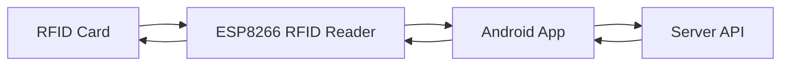

# 📱 RFIDManager


> **RFIDManager** is an Android-based application designed to manage RFID cards using an ESP8266 IoT device.  
The system supports reading RFID card data and writing new data to RFID cards through communication between the Android app, server, and ESP8266 device.

This project is suitable for **RFID access control systems, asset identification, inventory management, and IoT-based RFID automation**.

---

# 🚀 Features

## 📡 Read Mode

Read RFID card data using ESP8266 and display it on the Android application.

**Flow**

```
RFID Card → ESP8266 → Android App
```

Functions:

- Scan RFID cards
- Send card UID from ESP8266
- Receive data on Android application
- Display card information on the mobile interface

---

## 🔥 Write Mode

Write or burn new data to RFID cards using the Android application with server communication.

**Flow**

```
Android App → Server → Android App → ESP8266 → RFID Card
```

Functions:

- Request card data from server
- Receive encoded card data
- Send write command to ESP8266
- Burn data into RFID card

---

# 🏗 System Architecture



---

# 🔄 Data Flow

## Read Mode

```
RFID Card
   │
   ▼
ESP8266
   │
   ▼
Android App
   │
   ▼
Display Card Data
```

The ESP8266 reads RFID card data and sends the UID to the Android application for display.

---

## Write Mode

```
Android App
   │
   ▼
Server
   │
   ▼
Android App
   │
   ▼
ESP8266
   │
   ▼
RFID Card
```

The Android application requests card data from the server and sends it to the ESP8266 to write into the RFID card.

---

# 📡 Hardware Components

| Component | Description |
|----------|-------------|
| RFID Card | Card containing RFID chip |
| RFID Reader | RFID module connected to ESP8266 |
| ESP8266 | IoT microcontroller handling RFID communication |
| Android Device | Smartphone running RFIDManager |
| Server | Backend API for card data management |

---

# 🛠 Tech Stack

| Layer | Technology |
|------|-------------|
| Mobile App | Android (Flutter / Dart) |
| IoT Device | ESP8266 |
| RFID Module | RC522 / compatible reader |
| Communication | WiFi / HTTP API |
| Backend | Web server / API |
| Database | Server-side database |

---

## 📥 Download

- **RFIDManager App (Latest)**  
     <br>
  ➡️ [Release Page](https://github.com/viwaretech/RFIDManager/releases/latest)  
   ➡️ [Download](https://github.com/viwaretech/RFIDMAnager/releases/latest/download/RFIDManager.zip)

---


# 📝 License

This project is licensed under the [**GNU General Public License v3**](LICENSE).

---

# 👨‍💻 Author

**HARLEY AD**  
**IoT RFID Management Systems**

---

# ⭐ Support

If you find this project useful:

⭐ Star the repository  
🐛 Report issues  
💡 Suggest improvements
